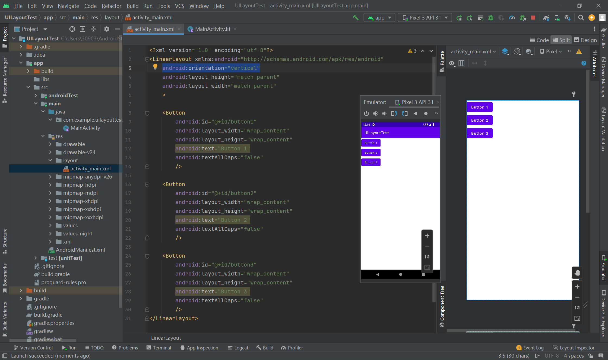
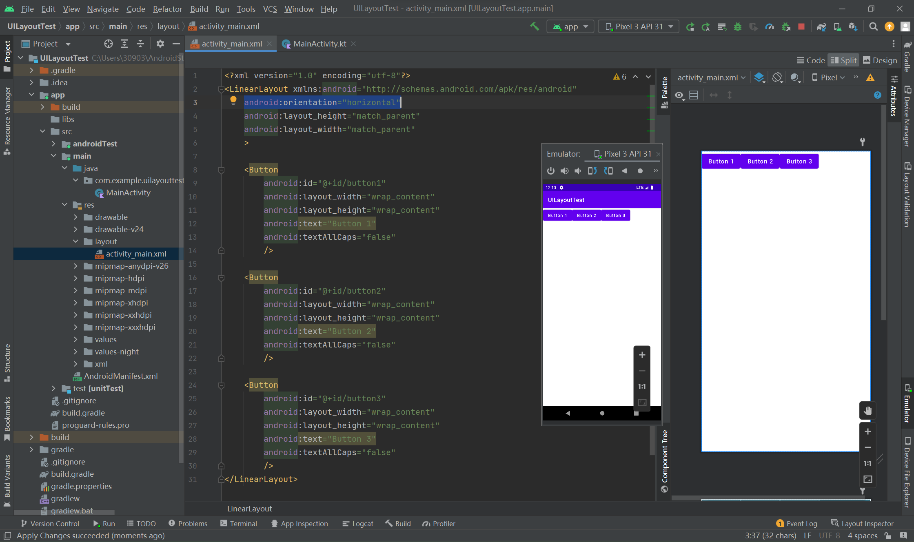
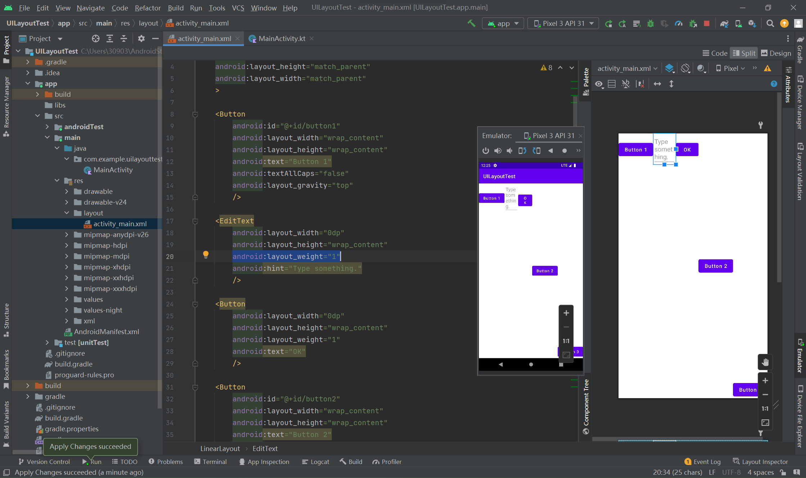
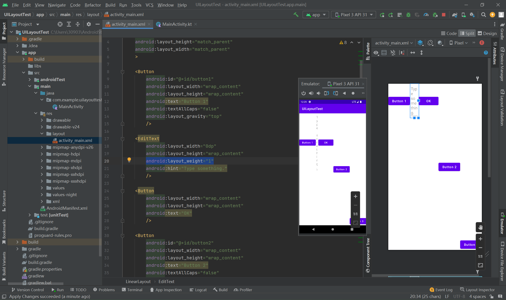
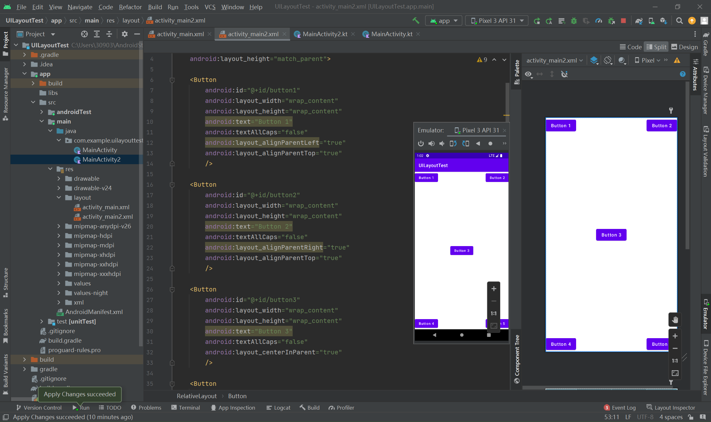
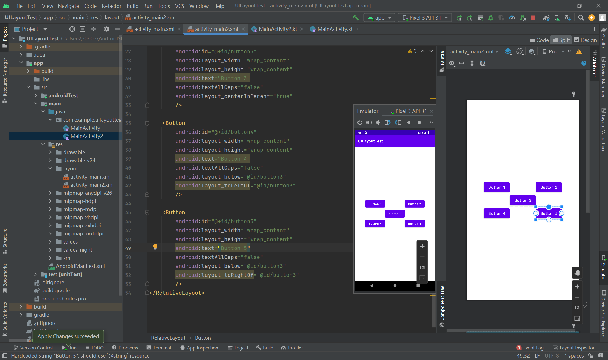
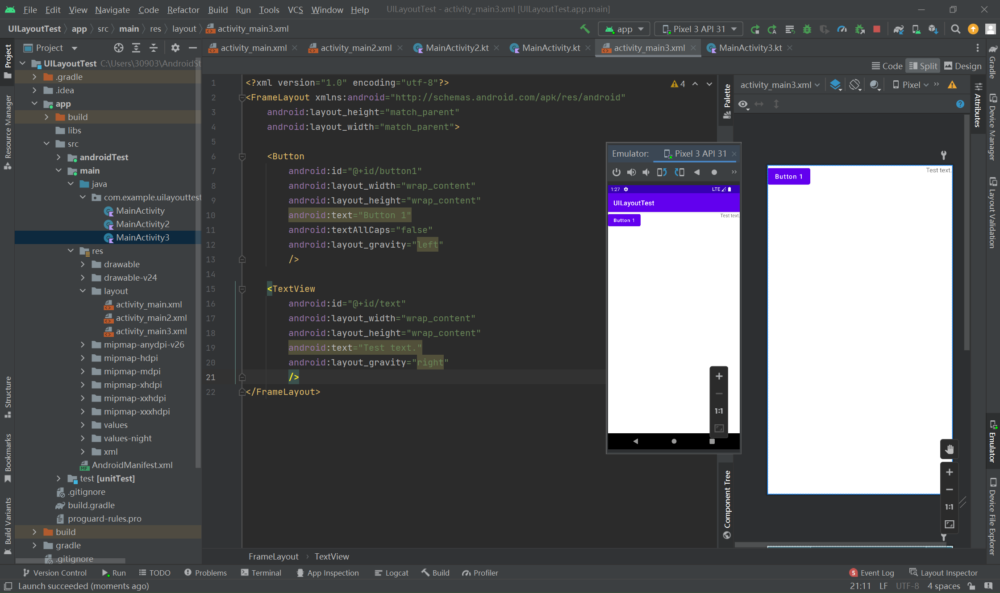

# 4.3.0 详解3种布局

（使用UILayoutTest）

布局，是用于存放多个控件的容器。一个完整的布局，可以由控件+布局的多层嵌套构成，一个布局里可以包含多个布局。

##### 1 LinearLayout

该布局又称线性布局，是之前几个项目都用到的布局。该布局会把它所包含的控件在线性方向上依次排列，可以指定水平或垂直方向排列。之前一直是默认垂直方向排列，这个可以通过android:orientation属性来指定。





控件们的对齐方式由layout_gravity指定。注意，如果采用了水平方向排列，则竖直方向上的对齐方式则不生效，反之亦然。


布局某种程度上也可以控制控件的大小，比如layout_weight，它可以用比例的方式调整控件的大小。



这里由于水平位置上已经有三个按钮了，剩下的空间就由这个输入框和按钮1：1分配了。如果只有一个控件由这个属性来指定大小，则它无论输入多少都会全部占用剩余空间。



##### 2 RelativeLayout

和LinearLayout不同，这种相对式的布局能够让控件出现在任何地方。相对的，属性设置也会更复杂。



```xml
<?xml version="1.0" encoding="utf-8"?>
<RelativeLayout xmlns:android="http://schemas.android.com/apk/res/android"
    android:layout_width="match_parent"
    android:layout_height="match_parent">

    <Button
        android:id="@+id/button1"
        android:layout_width="wrap_content"
        android:layout_height="wrap_content"
        android:text="Button 1"
        android:textAllCaps="false"
        android:layout_alignParentLeft="true"
        android:layout_alignParentTop="true"
        />

    <Button
        android:id="@+id/button2"
        android:layout_width="wrap_content"
        android:layout_height="wrap_content"
        android:text="Button 2"
        android:textAllCaps="false"
        android:layout_alignParentRight="true"
        android:layout_alignParentTop="true"
        />

    <Button
        android:id="@+id/button3"
        android:layout_width="wrap_content"
        android:layout_height="wrap_content"
        android:text="Button 3"
        android:textAllCaps="false"
        android:layout_centerInParent="true"
        />

    <Button
        android:id="@+id/button4"
        android:layout_width="wrap_content"
        android:layout_height="wrap_content"
        android:text="Button 4"
        android:textAllCaps="false"
        android:layout_alignParentLeft="true"
        android:layout_alignParentBottom="true"
        />

    <Button
        android:id="@+id/button5"
        android:layout_width="wrap_content"
        android:layout_height="wrap_content"
        android:text="Button 5"
        android:textAllCaps="false"
        android:layout_alignParentRight="true"
        android:layout_alignParentBottom="true"
        />
</RelativeLayout>
```

上述代码都是通过父布局的位置来指定自己的位置。同样的，也可以通过别的控件来指定自己的位置。



```xml
<?xml version="1.0" encoding="utf-8"?>
<RelativeLayout xmlns:android="http://schemas.android.com/apk/res/android"
    android:layout_width="match_parent"
    android:layout_height="match_parent">

    <Button
        android:id="@+id/button1"
        android:layout_width="wrap_content"
        android:layout_height="wrap_content"
        android:text="Button 1"
        android:textAllCaps="false"
        android:layout_above="@id/button3"
        android:layout_toLeftOf="@id/button3"
        />

    <Button
        android:id="@+id/button2"
        android:layout_width="wrap_content"
        android:layout_height="wrap_content"
        android:text="Button 2"
        android:textAllCaps="false"
        android:layout_above="@id/button3"
        android:layout_toRightOf="@id/button3"
        />

    <Button
        android:id="@+id/button3"
        android:layout_width="wrap_content"
        android:layout_height="wrap_content"
        android:text="Button 3"
        android:textAllCaps="false"
        android:layout_centerInParent="true"
        />

    <Button
        android:id="@+id/button4"
        android:layout_width="wrap_content"
        android:layout_height="wrap_content"
        android:text="Button 4"
        android:textAllCaps="false"
        android:layout_below="@id/button3"
        android:layout_toLeftOf="@id/button3"
        />

    <Button
        android:id="@+id/button5"
        android:layout_width="wrap_content"
        android:layout_height="wrap_content"
        android:text="Button 5"
        android:textAllCaps="false"
        android:layout_below="@id/button3"
        android:layout_toRightOf="@id/button3"
        />
</RelativeLayout>
```

这里只固定了一个button3的位置，剩下的控件都是通过button3的位置来确定自己位置的。

##### 3 FrameLayout

FrameLayout又名帧布局，它的布局没有很复杂的定位方式。在不设置的时候，全部默认左上角对齐，指定位置可以使用layout_gravity来指定，用法和LinearLayout相同。


