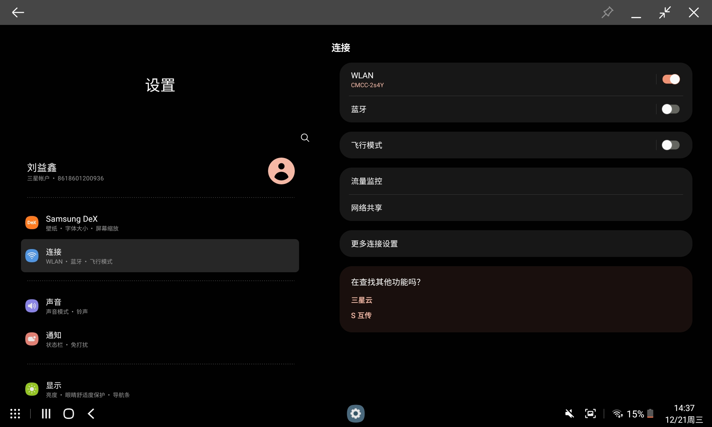
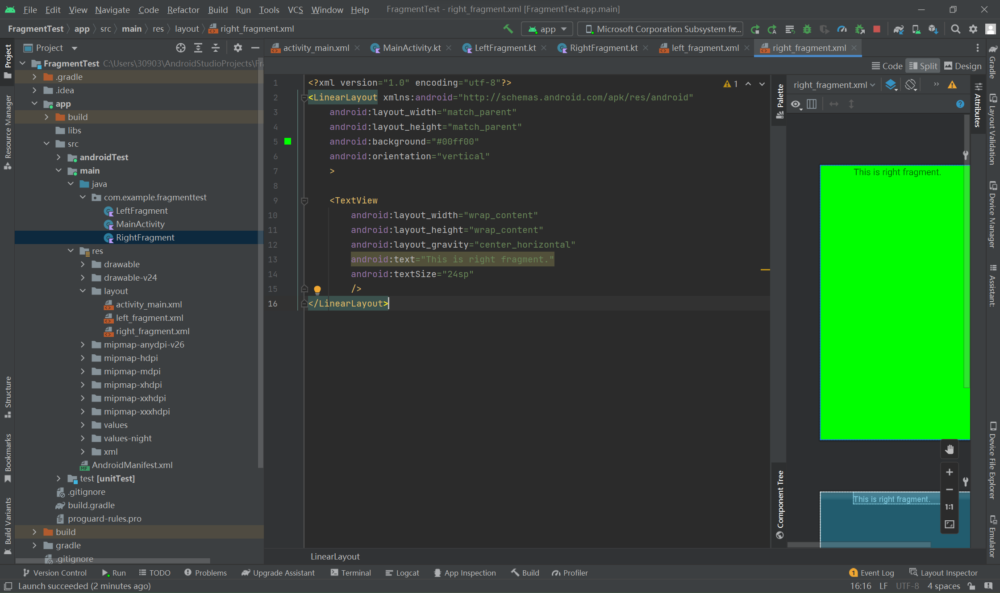
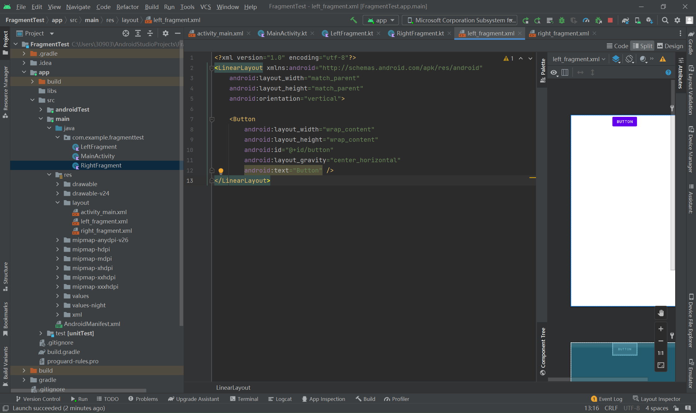
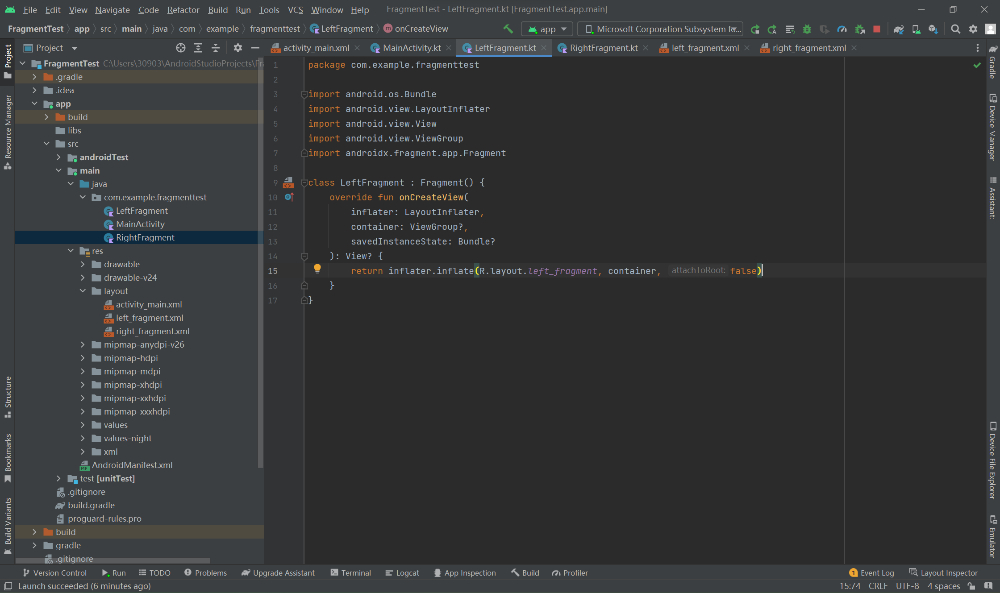
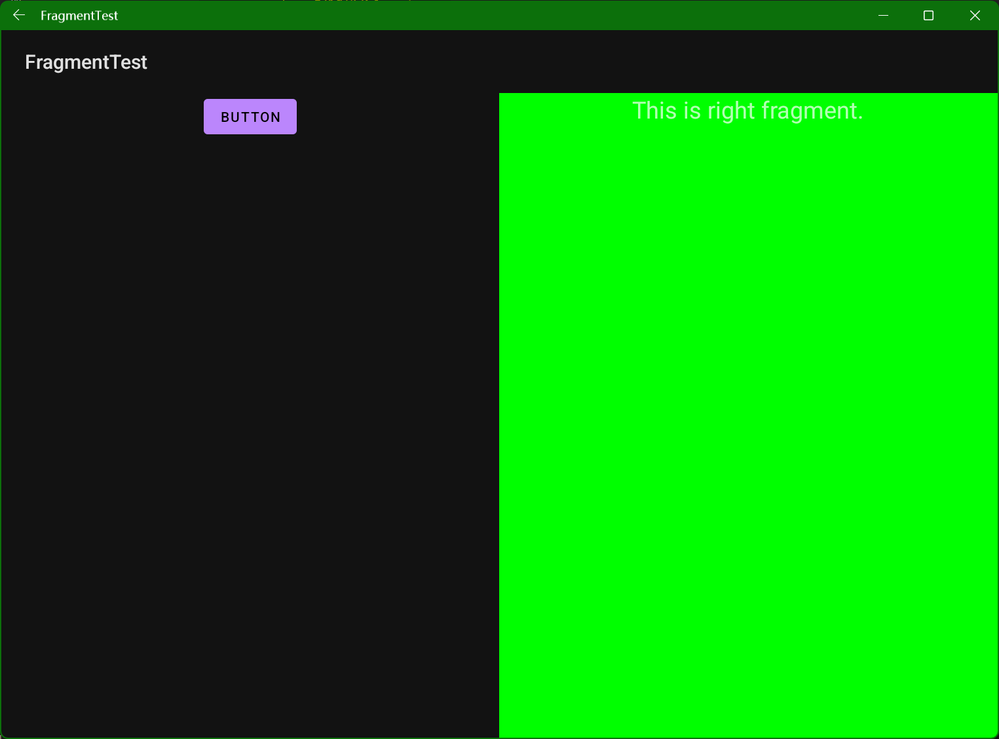

# 5.2.0 Fragment的使用方式

##### 1 Fragment是什么

Fragment是一种可以嵌入在Activity中的UI片段，它能让程序更加合理和充分地利用大屏幕的控件，因而在平板上应用的非常广泛。某种意义上，Fragment也是另一种Activity，同样包含布局，同样具有自己的生命周期。

如果一个应用全部由Activity构成，那么用户看到的大概会是这样的界面：


一个Activity全部用于展示标题，另一个Activity用于展示标题+内容。如果使用了Fragment，那么显示效果大概就像下图：



因此Fragment更适合为平板类的设备设计布局。它可以更合理的运用屏幕空间，并且展示更多信息。

##### 2 Fragment的使用方式

首先，新建布局文件right_fragment.xml和left_fragment.xml。





```xml
left_fragment.xml
<?xml version="1.0" encoding="utf-8"?>
<LinearLayout xmlns:android="http://schemas.android.com/apk/res/android"
    android:layout_width="match_parent"
    android:layout_height="match_parent"
    android:orientation="vertical">

    <Button
        android:layout_width="wrap_content"
        android:layout_height="wrap_content"
        android:id="@+id/button"
        android:layout_gravity="center_horizontal"
        android:text="Button" />
</LinearLayout>

right_fragment.xml
<?xml version="1.0" encoding="utf-8"?>
<LinearLayout xmlns:android="http://schemas.android.com/apk/res/android"
    android:layout_width="match_parent"
    android:layout_height="match_parent"
    android:background="#00ff00"
    android:orientation="vertical"
    >

    <TextView
        android:layout_width="wrap_content"
        android:layout_height="wrap_content"
        android:layout_gravity="center_horizontal"
        android:text="This is right fragment."
        android:textSize="24sp"
        />
</LinearLayout>
```

对应的，新建两个类：LeftFragment和RightFragment，并且使他们都继承自Fragment。



```kotlin
package com.example.fragmenttest

import android.os.Bundle
import android.view.LayoutInflater
import android.view.View
import android.view.ViewGroup
import androidx.fragment.app.Fragment

class LeftFragment : Fragment() {
    override fun onCreateView(
        inflater: LayoutInflater,
        container: ViewGroup?,
        savedInstanceState: Bundle?
    ): View? {
        return inflater.inflate(R.layout.left_fragment, container, false)
    }
}
```

```kotlin
class RightFragment : Fragment() {
    override fun onCreateView(
        inflater: LayoutInflater,
        container: ViewGroup?,
        savedInstanceState: Bundle?
    ): View? {
        return inflater.inflate(R.layout.right_fragment, container, false)
    }
}
```

（继承的时候要继承自androidx.fragment.app.Fragment，否则有的特性可能不可用。）

最后修改activity_main.xml。

```kotlin
<?xml version="1.0" encoding="utf-8"?>
<LinearLayout xmlns:android="http://schemas.android.com/apk/res/android"
    android:layout_width="match_parent"
    android:layout_height="match_parent"
    android:orientation="horizontal">

    <fragment
        android:layout_width="0dp"
        android:layout_height="match_parent"
        android:layout_weight="1"
        android:name="com.example.fragmenttest.LeftFragment"
        android:id="@+id/leftFrag"
        />

    <fragment
        android:layout_width="0dp"
        android:layout_height="match_parent"
        android:layout_weight="1"
        android:name="com.example.fragmenttest.RightFragment"
        android:id="@+id/rightFrag"
        />

</LinearLayout>
```

最终的显示效果：



这就是最简单的Fragment的使用方式。

##### 3 动态添加Fragment
