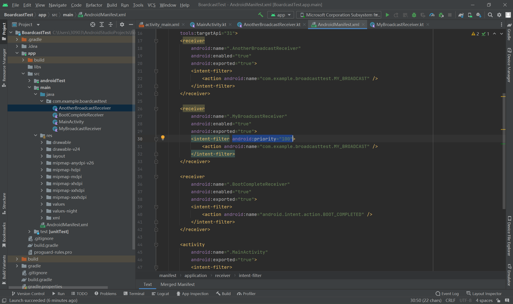

# 6.3.0 发送自定义广播

（使用BroadcastTest项目）

##### 1 发送标准广播

首先，先建立一个MyBroadcastReceiver，使其接收到广播时能够发送一条消息。

之后在AndroidManifest.xml中修改intentFilter使其能够接收广播：

之后修改布局，加入一个按钮：

最后修改MainActivity，给按钮加入执行逻辑：

这里构建了一个intent对象，并且把要发送的广播的值传进去，之后调用setPackage()方法传入当前应用的包名，最后调用sendBroadcast将广播发送出去就可以了。package是getPackage()的语法糖，用于获取当前应用的包名，

由于Android 8.0之后的版本静态注册的BroadcastReceiver都无法接收隐式广播，所以这里必须要调用setPackage()来指定这条广播的目标，从而让它变成一条显式广播，否则静态注册的BroadcastReceiver是接收不到的。

最终效果：

##### 2 发送有序广播

新建另外一个BroadcastReceiver：AnotherBroadcastReceiver。

目前，如果点击按钮发送广播，那么会有两条提示信息。现在更改MainActivity中的代码：

发送有序广播和发送标准广播的区别就在这个方法上。setOrderedBroadcast()接收两个参数，第一个是intent，第二个是一个与权限有关的字符串。而关于有序广播的先后顺序，它需要在BroadcastReceiver注册时修改：

这一条属性就是优先级顺序，优先级高的就一定会优先收到广播，那么它也可以选择是否截断这条广播：

abortBroadcast()这个方法就表示截断广播，后面的AnotherBroadcastReceiver就无法收到广播。

最终效果：只有

