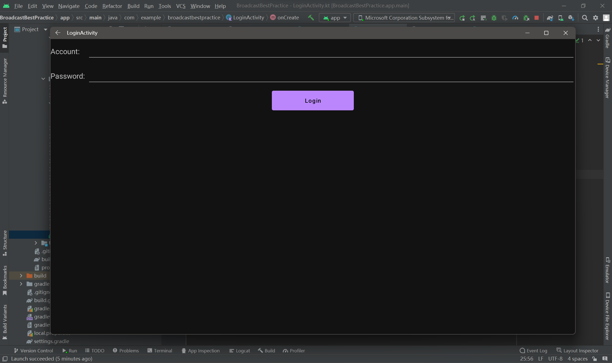
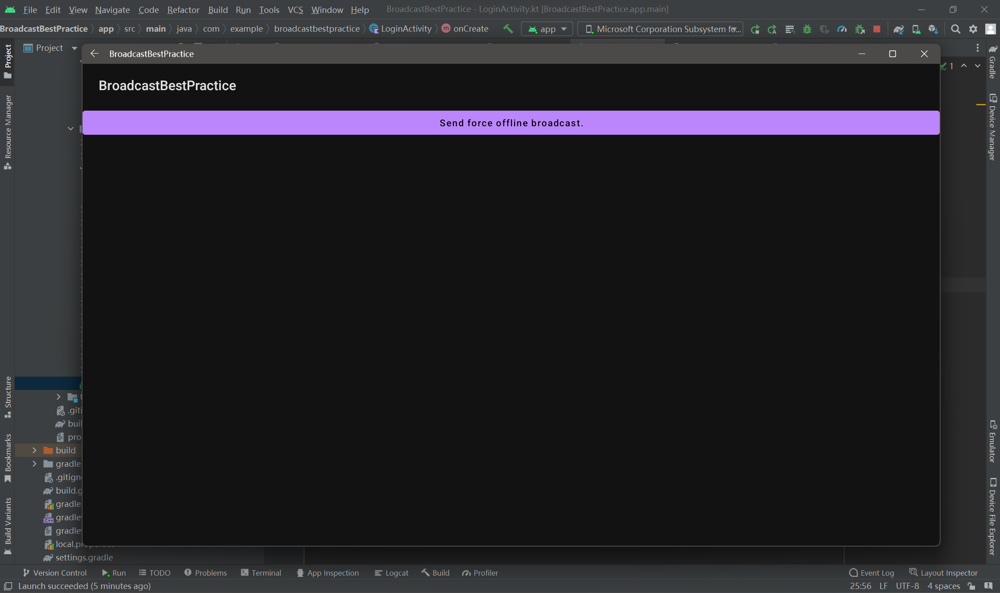
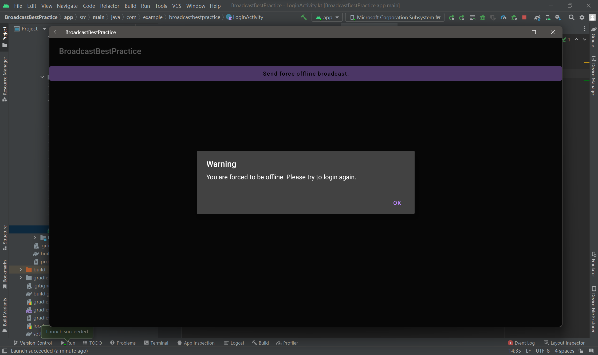
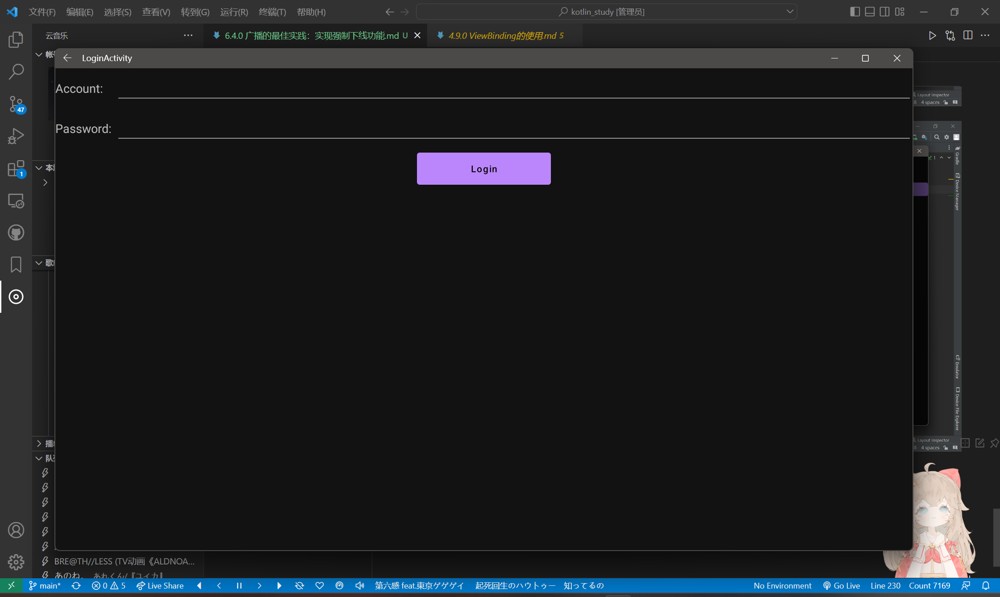

# 6.4.0 广播的最佳实践：实现强制下线功能

（使用BroadcastBestPractice项目）

强制下线应该是一个比较常见的功能，它在各个需要账户登录的应用中都有。比如说QQ和微信，假如说在另外一台设备上登录了相同的账号，那么原来的设备上不论是什么页面，都会弹出下线的通知框，点击确定后会立即关闭所有的页面。这个通知框肯定不会是每个Activity中都有，那样只会造成无意义的代码重复，而借助广播可以很轻松的达成这个功能。

首先，先完成关闭所有Activity的功能，创建ActivityCollector类并修改代码：

```kotlin
object ActivityCollector {
    private val activities = ArrayList<Activity>()

    fun addActivity(activity: Activity){
        activities.add(activity)
    }

    fun removeActivity(activity: Activity){
        activities.remove(activity)
    }

    fun finishAll(){
        for (activity in activities){
            if (!activity.isFinishing){
                activity.finish()
            }
        }
        activities.clear()
    }
}
```

然后创建BaseActivity作为所有Activity的父类：

```kotlin
open class BaseActivity : AppCompatActivity() {
    override fun onCreate(savedInstanceState: Bundle?) {
        super.onCreate(savedInstanceState)
        ActivityCollector.addActivity(this)
    }

    override fun onDestroy() {
        super.onDestroy()
        ActivityCollector.removeActivity(this)
    }
}
```

之后，需要创建一个LoginActivity来作为登录界面。修改login_layout.xml如下：

```xml
<LinearLayout xmlns:android="http://schemas.android.com/apk/res/android"
    android:layout_width="match_parent"
    android:layout_height="match_parent"
    android:orientation="vertical"
    >

    <LinearLayout
        android:layout_width="match_parent"
        android:layout_height="60dp"
        android:orientation="horizontal">

        <TextView
            android:layout_width="90dp"
            android:layout_height="wrap_content"
            android:layout_gravity="center_vertical"
            android:textSize="18sp"
            android:text="Account:" />

        <EditText
            android:layout_width="0dp"
            android:layout_height="wrap_content"
            android:layout_weight="1"
            android:layout_gravity="center_vertical"
            android:id="@+id/accountEdit" />
    </LinearLayout>

    <LinearLayout
        android:layout_width="match_parent"
        android:layout_height="60dp"
        android:orientation="horizontal">

        <TextView
            android:layout_width="90dp"
            android:layout_height="wrap_content"
            android:layout_gravity="center_vertical"
            android:textSize="18sp"
            android:text="Password: "/>

        <EditText
            android:layout_width="0dp"
            android:layout_height="wrap_content"
            android:layout_weight="1"
            android:layout_gravity="center_vertical"
            android:id="@+id/passwordEdit"
            android:inputType="textPassword"/>
    </LinearLayout>

    <Button
        android:layout_width="200dp"
        android:layout_height="60dp"
        android:id="@+id/login"
        android:layout_gravity="center_horizontal"
        android:text="Login"
        android:textAllCaps="false" />
</LinearLayout>
```

修改LoginActivity如下：

```kotlin
class LoginActivity : BaseActivity() {
    private lateinit var binding: ActivityLoginBinding

    override fun onCreate(savedInstanceState: Bundle?) {
        super.onCreate(savedInstanceState)
        binding = ActivityLoginBinding.inflate(layoutInflater)
        setContentView(binding.root)

        binding.login.setOnClickListener {
            val account = binding.accountEdit.text.toString()
            val password = binding.passwordEdit.text.toString()
            if (account == "admin" && password == "123456"){
                val intent = Intent(this, MainActivity::class.java)
                startActivity(intent)
                finish()
            } else {
                Toast.makeText(this, "account or password is invaild.", Toast.LENGTH_SHORT).show()
            }
        }
    }
}
```

这里只做了一个简单的登录页面，如果账号密码正确就跳转到MainActivity，如果不正确就会有提示信息。

之后在activity_main.xml中加入一个强制下线的按钮：

```xml
<LinearLayout xmlns:android="http://schemas.android.com/apk/res/android"
    android:layout_width="match_parent"
    android:layout_height="match_parent"
    android:orientation="vertical">
  
    <Button
        android:layout_width="match_parent"
        android:layout_height="wrap_content"
        android:id="@+id/forceOffline"
        android:text="Send force offline broadcast."
        android:textAllCaps="false"
        />
</LinearLayout>
```

并且在MainActivity中加入相应的逻辑：

```kotlin
class MainActivity : BaseActivity() {
    private lateinit var binding : ActivityMainBinding
    override fun onCreate(savedInstanceState: Bundle?) {
        super.onCreate(savedInstanceState)
        binding = ActivityMainBinding.inflate(layoutInflater)
        setContentView(binding.root)
        binding.forceOffline.setOnClickListener {
            val intent = Intent("com.example.broadcastbestpractice.FORCE_OFFLINE")
            sendBroadcast(intent)
        }
    }
}
```

注意，广播是由MainActivity的这个按钮发出的，但相对应的BroadcastReceiver和确认框逻辑并不在这里。首先，为了避免每个Activity都写一个确认框的问题，这个确认框是和BroadcastReceiver写在一起的。其次，这个BroadcastReceiver不能是静态的，如果是静态的，那么它就无法实现对话框；它也不能是动态的，不能为了不重复确认框的逻辑就给每个Activity都写一个动态的BroadcastReceiver。那么很明显了，实现这个功能需要在BaseActivity里写一个动态的BroadcastReceiver：

```kotlin
open class BaseActivity : AppCompatActivity() {

    lateinit var receiver : ForceOfflineReceiver

    override fun onCreate(savedInstanceState: Bundle?) {
        super.onCreate(savedInstanceState)
        ActivityCollector.addActivity(this)
    }

    override fun onResume() {
        super.onResume()
        val intentFilter = IntentFilter()
        intentFilter.addAction("com.example.broadcastbestpractice.FORCE_OFFLINE")
        receiver = ForceOfflineReceiver()
        registerReceiver(receiver, intentFilter)
    }

    override fun onPause() {
        super.onPause()
        unregisterReceiver(receiver)
    }

    override fun onDestroy() {
        super.onDestroy()
        ActivityCollector.removeActivity(this)
    }

    inner class ForceOfflineReceiver : BroadcastReceiver(){
        override fun onReceive(context: Context?, intent: Intent?) {
            AlertDialog.Builder(context!!).apply {
                setTitle("Warning")
                setMessage("You are forced to be offline. Please try to login again.")
                setCancelable(false)
                setPositiveButton("OK"){ _, _ ->
                    ActivityCollector.finishAll() // 调用销毁所有Activity的方法
                    val i = Intent(context, LoginActivity::class.java)
                    context.startActivity(i) // 重新打开LoginActivity
                }
                show()
            }
        }
    }
}
```

首先，先是ForceOfflineReceiver中的AlertDialog.Builder()来构建一个对话框，设置了各种属性之后在OK按钮里调用finishAll()，并且打开LoginActivity。注意，这个对话框必须要调用setCancelable()来让这个对话框变成不可取消的对话框。

之后，是ForceOfflineReceiver的注册问题，这次是在onResume()和onPause()之中进行注册和取消注册的。原因在于，这次只需要位于栈顶的Activity接收到这个广播，不在栈顶的Activity没有必要去接收。这样写能够在Activity失去栈顶位置时自动取消ForceOfflineReceiver的注册。

最后，修改ActivityManifest.xml中的代码，使得LoginActivity设置为主Activity（也可以在创建LoginActivity时将其设置为LanuchActivity），这样这个功能就完成了。







（点击OK之后重新打开LoginActivity）


