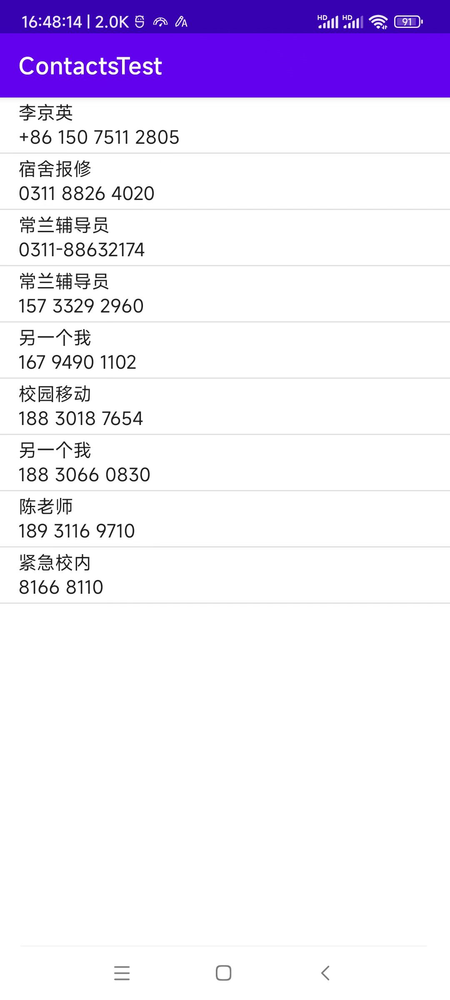

# 8.3.0 访问其他程序中的数据

（使用ContactsTest项目）

ContentProvider一般情况下有两种情况：一种是使用现有的ContentProvider读取和操作相应程序中的数据；另一种是创建自己的ContentProvider，给程序的数据提供外部访问接口。如果一个应用程序提供了给数据的外部访问接口，那么任何其他的应用都可以通过这个接口来对这部分数据进行访问。

##### 1 ContentProvider的基本用法

对于每一个应用来说，如果想要访问ContentProvider里共享的数据，那么必须借助ContentResolver类，可以通过Context类里的getContentResolver()获取这个类的实例。这个类里提供了insert()，update()，delete()和query()方法用于执行对应操作。这四个增删改查方法和数据库里那个SQLiteDatabase里的那四个方法在参数上不太一样，它们不接收表名参数，取而代之的是一个Uri参数。

Uri参数又被称为内容URI，它给ContentProvider中的数据建立了唯一的标识符，它主要由两部分构成：authority和path。authority是用于区分不同应用的，所以一般情况下这个东西是使用应用包名来命名的，比如一个包名为com.example.app，那么它对应的authority就是com.example.app.provider。path用于对同一应用中的不同表作区分的，通常会添加在authority后面。比如说com.example.app.provider/table1，指的就是com.example.app这个应用的数据库的table1表。最后为了声明这是内容URI，在这个字符串的头部还要加上协议声明，所以正常情况下一个标准内容URI大概就类似这样：`content://com.example.app.provider/table1`

明确了内容URI字符串之后，还需要将其解析为Uri对象才可以作为参数传入，就像这样：

```kotlin
val uri = Uri.parse("comtent://com.example.app.provider/table1")
```

针对ContentResolver类里的这四个增删改查方法，具体示例如下：

增：

```kotlin
val values = contentValuesOf("column1" to "text", "column2" to 1)
contentResolver.insert(uri, values)
```

删：

```kotlin
contentResolver.delete(uri, "column2 = ?", arrayOf("1"))
```

改：

```kotlin
val values = contentValuesOf("column1" to "")
contentResolver.update(uri, values, "column1 = ? and column2 = ?", arrayOf("text", "1"))
```

查可能有点费劲，query()方法需要的参数如下：

| query()方法参数 |        对应SQL部分        |             描述             |
| :-------------: | :-----------------------: | :---------------------------: |
|       uri       |      from table_name      |     指定查询的应用和表名     |
|   projection   |  select column1, column2  |        指定查询的列名        |
|    selection    |   where column = value   |      指定where的约束条件      |
|  selectionArgs  |             -             | 为where中的占位符提供具体的值 |
|    sortOrder    | order by column1, column2 |    指定查询结果的排序方式    |

query()最终返回的是一个Cursor对象，取值还是得遍历这个Cursor对象才能取出来：

```kotlin
while (cursor.moveToNext()) {
	val column1 = cursor.getString(cursor.getColumnIndex("column1"))
	val column2 = cursor.getInt(cursor.getColumnIndex("column2"))
}
cursor.close()
```

##### 2 读取系统联系人

要读取系统联系人，首先先搞一个能显示联系人的界面。在activity_main.xml里新建一个ListView，然后在AndroidManifest里增加权限，并且修改MainActivity：

```kotlin
class MainActivity : AppCompatActivity() {

    lateinit var binding : ActivityMainBinding

    private val contactsList = ArrayList<String>()
    private lateinit var adapter : ArrayAdapter<String>

    override fun onCreate(savedInstanceState: Bundle?) {
        super.onCreate(savedInstanceState)
        binding = ActivityMainBinding.inflate(layoutInflater)
        setContentView(binding.root)

        adapter = ArrayAdapter(this, android.R.layout.simple_list_item_1, contactsList)
        binding.contactsView.adapter = adapter

        if (ContextCompat.checkSelfPermission(this, android.Manifest.permission.READ_CONTACTS) != PackageManager.PERMISSION_GRANTED) {
            ActivityCompat.requestPermissions(this, arrayOf(android.Manifest.permission.READ_CONTACTS), 1)
        } else {
            readContacts()
        }
    }

    override fun onRequestPermissionsResult(
        requestCode: Int,
        permissions: Array<out String>,
        grantResults: IntArray
    ) {
        super.onRequestPermissionsResult(requestCode, permissions, grantResults)
        when (requestCode) {
            1 -> {
                if (grantResults.isNotEmpty() && grantResults[0] == PackageManager.PERMISSION_DENIED) {
                    readContacts()
                } else {
                    Toast.makeText(this, "You denied the permission.", Toast.LENGTH_SHORT).show()
                }
            }
        }
    }

    private fun readContacts() {
        // 查询联系人数据
        contentResolver.query(ContactsContract.CommonDataKinds.Phone.CONTENT_URI, null, null, null, null)?.apply {
            while (moveToNext()) {
                // 获取联系人姓名
                val displayName = getString(getColumnIndexOrThrow(ContactsContract.CommonDataKinds.Phone.DISPLAY_NAME))
                // 获取联系人手机号
                val number = getString(getColumnIndexOrThrow(ContactsContract.CommonDataKinds.Phone.NUMBER))
                contactsList.add("$displayName\n$number")
            }
            adapter.notifyDataSetChanged()
            close()
        }
    }
}
```

首先，在onCreate()里首先初始化ListView，之后向8.2.0一样请求权限，如果已经有了权限则直接执行readContacts()开始读取联系人。

关于这个readContacts()，首先，先调用ContentResolver的query()方法查询系统的联系人数据。但是这里传的Uri参数并没有用Uri.parse()方法，因为ContactContract.CommenDataKinds.Phone类已经封装好了并且提供了一个CONTENT_URI常量，因此不需要再用Uri.parse()方法。之后用while来遍历这个返回的Cursor对象，并且用apply()简化了代码。联系人和号码对应的常量分别是ContactsContract.CommonDataKinds.Phone.DISPLAY_NAME和ContactsContract.CommonDataKinds.Phone.NUMBER，取出来之后再拼接，拼接之后添加到ListView的数据源里，再通知一下ListView让它刷新，最后关闭这个Cursor对象。

最后的效果如下：


