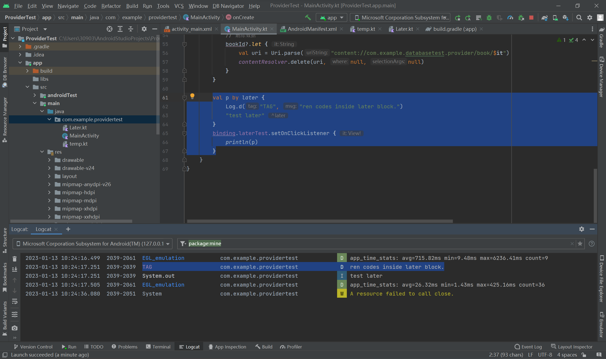

# 8.5.0 Kotlin课堂：泛型和委托

##### 1 泛型的基本用法

首先先解释一下泛型是什么。一般情况下，所有的变量都必须指定类型才能使用，而泛型允许在不指定具体类型的情况下进行编程。比如说List，它并不限制存放的数据的类型，因为它是通过泛型实现的。因此，才能够通过 `List<Int>`这样的语法来构建具体类型的列表。

泛型主要有两种定义方式：一种是定义泛型类，另一种是定义泛型方法，使用的语法结构都是 `<T>`，当然这个T是随意的，用啥字母都行，T只是一个约定俗成的写法。

定义一个泛型类，就可以这么写：

```kotlin
class MyClass<T> {

    fun method(param: T): T {
        return param
    }
}
```

此时，它就是一个泛型类，在调用MyClass类和method()方法的时候，就可以将泛型指定为具体的类型：

```kotlin
val myClass = MyClass<Int>()
val result = myClass.method(123)
```

如果不想定义泛型类，只想要一个泛型方法的话，就可以这么写：

```kotlin
class MyClass {

    fun <T> method(param: T): T {
        return param
    }
}
val myClass = MyClass()
val result = myClass.method<Int>(123)
```

当然了，由于kotlin有类型推导机制，所以调用泛型方法的时候可以不指定类型。

kotlin还允许对泛型的类型进行上界的限制，比如说这样：

```kotlin
class MyClass {

    fun <T: Number> method(param: T): T {
        return param
    }
}
val myClass = MyClass()
val result = myClass.method(123)
```

此时这个泛型就被限制为数字类，也就是只能指定为Int，Double，Float等。如果指定为String的话会报错。由于泛型的上界默认是Any?，所以泛型也是可以传null的，如果想把空值排除掉，就可以指定上界为Any。

在6.5.1里，当时是写了个高阶函数build：

```kotlin
fun StringBuilder.build(block: StringBuilder.() -> Unit): StringBuilder {
    block()
    return this
}
```

这个函数的作用和apply()基本上是一样的，但是目前它只能应用于StringBuilder类。通过泛型，就可以将其应用于任何类：

```kotlin
fun <T> T.build(block: T.() -> Unit): T {
    block()
    return this
}
```

只要将所有指定为StringBuilder的地方替换为泛型就可以了。

##### 2 类委托和委托属性

委托是一种设计模式，它的基本理念是：操作对象自己不会去处理某段逻辑，而是会把工作委托给另外一个辅助对象去处理。kotlin中的委托分为两种：类委托和委托属性。

###### 1 类委托

类委托的核心思想在于将一个类的具体实现委托给另一个类去完成。这么说确实是比较抽象，具体示例如下：

```kotlin
class MySet<T>(val helperSet: HashSet<T>) : Set<T> {
    override val size: Int
        get() = helperSet.size

    override fun contains(element: T): Boolean {
        return helperSet.contains(element)
    }

    override fun containsAll(elements: Collection<T>): Boolean {
        return helperSet.containsAll(elements)
    }

    override fun isEmpty(): Boolean {
        return helperSet.isEmpty()
    }

    override fun iterator(): Iterator<T> {
        return helperSet.iterator()
    }
}
```

可以看到，这个类接收一个HashSet参数，这就是所谓的“另一个类”。在Set接口的所有的方法的实现里，都没有进行自己的实现，而是直接调用这个HashSet参数的方法实现。

这种写法的好处在于，可以将大部分的方法交给这“另一个类”来实现，而灵活的选择少部分方法让自己来重写，甚至可以加入一些自己独有的方法，使之成为一个全新的类。当然了，这样写也有一定的麻烦——那“大部分方法”。如果这些不需要自己实现的方法一旦多起来，写起来就会非常费时间。这一点可以通过正式的类委托的写法来解决：

```kotlin
class MySetTemp<T>(val helperSet: HashSet<T>) : Set<T> by helperSet{
    override fun contains(element: T): Boolean {
        return helperSet.contains(element)
    }
    fun helloWorld() = println("Hello World")
}
```

类委托的关键字是by，这样写和上面那么写效果是相同的，但是代码明显简化了，而且还是能够自由选择方法来重写，也可以新加方法进去，其他的方法还是按类委托的模式来处理，其他的Set接口中的功能，则和HashSet()保持一致。

###### 2 委托属性

和类委托类似的，委托属性的核心思想是将一个属性（字段）的具体实现委托给另一个类完成，关键字还是by，代码示例如下：

```kotlin
class Delegate {
    var propValue: Any? = null

    operator fun getValue(myClass: MyClass, prop: KProperty<*>): Any? {
        return propValue
    }
    operator fun setValue(myClass: MyClass, prop: KProperty<*>, value: Any?) {
        propValue = value
    }
}
class MyClass {
    var p by Delegate()
}
```

这个写法，意思就是将p的具体实现委托给了Delegate类完成。调用p属性时，就自动调用Delegate类的getValue()方法，当给p赋值的时候就自动调用Delegate类的setValue()方法。

至于这个Delegate类，这是一种标准的代码实现模板，在这个类里必须实现getValue()和setValue()，并且用operator关键字进行声明。getValue()接收两个参数：第一个参数用于声明该Delegate类的委托功能可以在什么类里使用，这里写了MyClass就意味着委托功能只能在这个类里使用；第二个参数KProperty<*>是kotlin的一个属性操作类，可以用于获取各种属性有关的值，目前用不上，但是必须声明。另外，`<*>`这种泛型的写法表示不指定或者不关心泛型的具体类型，写这个只是通过编译而已的意思。至于返回值是不限定类型的，只要根据逻辑去写就行。

setValue()也是类似的，它接收三个参数。前两个参数和getValue()一致，最后一个参数表示具体要赋给委托属性的值，这个参数的类型必须和getValue()的返回值的类型保持一致。

还有一个点，如果委托属性声明为val的时候，可以不写setValue()，只需要实现getValue()就可以了。

##### 3 实现一个自己的lazy函数

在8.4.2中初始化uriMatcher变量的时候，使用了lazy，也就是所谓的“懒加载”技术。在了解过委托之后，这个lazy的工作原理就清楚了：

```kotlin
private val uriMatcher by lazy {
        val matcher = UriMatcher(UriMatcher.NO_MATCH)
        matcher.addURI(authority, "book", bookDir)
        matcher.addURI(authority, "book/#", bookItem)
        matcher.addURI(authority, "category", categoryDir)
        matcher.addURI(authority, "category/#", categoryItem)
        matcher
    }
```

实际上，这段代码的核心就是by lazy{}。by表示委托属性，lazy则是一个高阶函数。在lazy函数中会创建一个Delegate对象，当调用uriMatcher时，其实调用的是Delegate对象的getValue()方法，然后在这个getValue()方法中又会调用lazy函数传入的Lambda表达式，这样表达式中的代码就能得到执行，并且调用p属性后得到的值就是Lambda表达式中最后一行代码的返回值。

一旦了解了lazy方法的原理。实现起来就不难了，新建一个Later.kt，并且修改代码：

```kotlin
class Later<T> (val block: () -> T) {
    var value: Any? = null
    operator fun getValue(any: Any?, prop: KProperty<*>): T {
        if (value == null) {
            value = block()
        }
        return value as T
    }
}
```

首先，这里定义了一个Later类，并将其指定为泛型类。Later的构造函数中接受一个函数类型参数，这个函数类型参数不接收任何参数，并且返回值类型就是Later类指定的泛型。然后在这个类里实现getValue()方法，它的第一个参数指定为Any?类型，表示这个Later的委托功能在所有类中都可以使用。然后使用了一个value变量对值进行缓存，如果value为空就调用构造函数中传入的函数类型参数去获取值，否则就直接返回。因为懒加载技术不会对属性进行赋值，所以这里可以不写setValue()。

写完这些，委托属性的功能就基本完成了，但是为了让它的用法更接近lazy函数，最好再定义一个顶层函数，它直接写在Later.kt里就可以，但不能写在Later类里：

```kotlin
fun <T> later(block: () -> T) = Later(block)
```

这个顶层函数也是一个泛型函数，并且它也接收一个函数类型参数。这个顶层函数的作用就是创建Later类的实例，并且将接收的函数类型参数传给Later类的构造函数。

最后，通过一个按钮来验证later方法是否有效：



能看到，在启动Activity的时候没有打印日志，而是只在第一次点击按钮的时候打印了日志，说明确实是生效了。

最后，虽然later功能上已经和lazy很相似了，但是lazy还有诸如同步，空值处理等功能，因此正常项目中直接用lazy即可。
