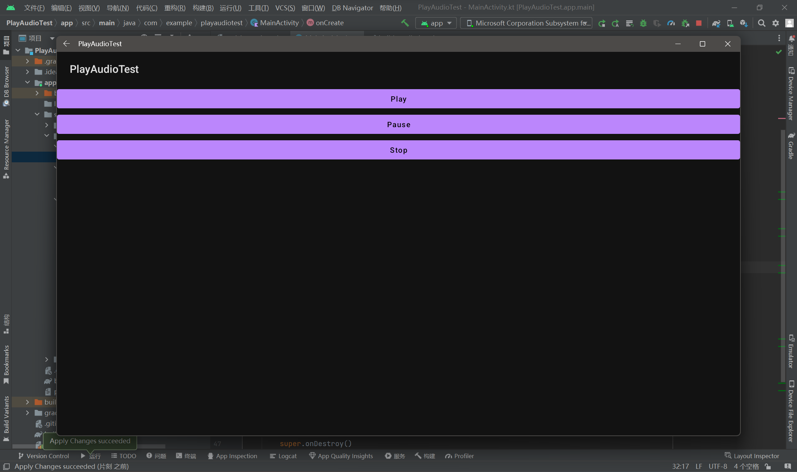
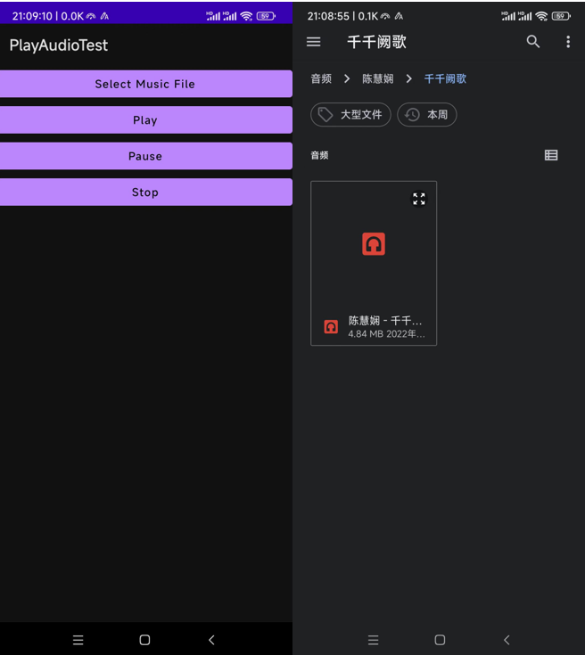
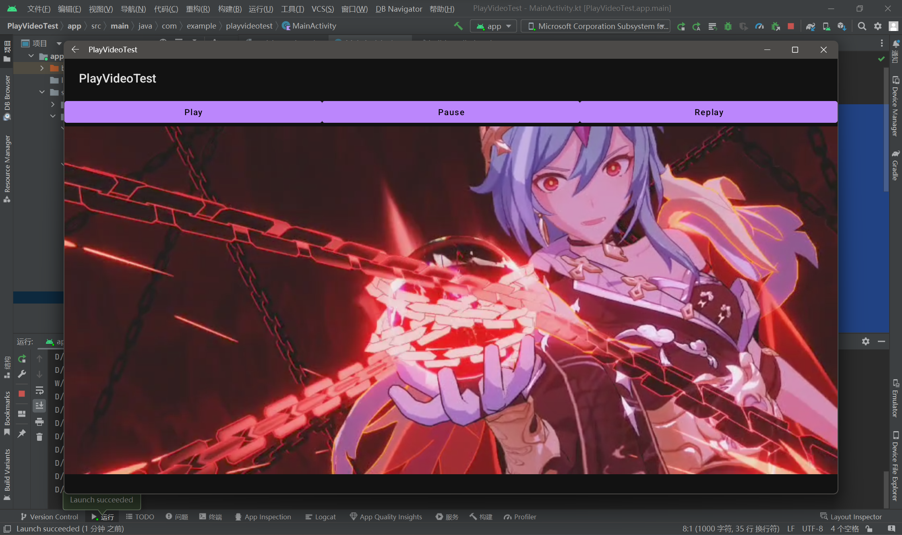

# 9.4.0 播放多媒体文件

（使用PlayAudioTest和PlayVideoTest项目）

##### 1 播放音频

在Android里面播放音频，借助的是MediaPlayer类实现的，它对多种格式的音频文件提供了非常全面的控制方法：

|     方法名     |                         功能描述                         |
| :-------------: | :-------------------------------------------------------: |
| setDataSource() |                设置要播放的音频文件的位置                |
|    prepare()    |            在开始播放之前调用，以完成准备工作            |
|     start()     |                    开始或继续播放音频                    |
|     pause()     |                           暂停                           |
|     reset()     |            将MediaPlayer对象重置为刚创建的状态            |
|    seekTo()    |               从指定的位置开始播放音频文件               |
|     stop()     | 停止播放音频。调用此方法后的MediaPlayer对象无法再播放音频 |
|    release()    |                释放与MediaPlayer有关的资源                |
|   isPlaying()   |            判断当前MediaPlayer是否正在播放音频            |
|  getDuration()  |                 获取载入的音频文件的时长                 |

首先实现播放应用程序安装包里的音频的功能。Android Studio允许开发者在项目中新建一个位于app/src/main文件夹下的assets文件夹，并且这个文件夹下面什么都可以放。之后在程序里就可以通过AssetManager这个类提供的接口对assets目录下的文件进行读取。新建一个assets文件夹，往里面传随便一个mp3文件，并且修改MainActivity：

```kotlin
class MainActivity : AppCompatActivity() {

    private lateinit var binding : ActivityMainBinding

    private val mediaPlayer = MediaPlayer()

    override fun onCreate(savedInstanceState: Bundle?) {
        super.onCreate(savedInstanceState)
        binding = ActivityMainBinding.inflate(layoutInflater)
        setContentView(binding.root)

        initMediaPlayer()

        binding.play.setOnClickListener {
            if (!mediaPlayer.isPlaying) {
                mediaPlayer.start()
            }
        }
        binding.pause.setOnClickListener {
            if (!mediaPlayer.isPlaying) {
                mediaPlayer.pause()
            }
        }
        binding.stop.setOnClickListener {
            if (!mediaPlayer.isPlaying) {
                mediaPlayer.reset()
                initMediaPlayer()
            }
        }
    }

    private fun initMediaPlayer() {
        val assetManager = assets
        val fd = assetManager.openFd("tempMusic.mp3")
        mediaPlayer.setDataSource(fd)
        mediaPlayer.prepare()
    }

    override fun onDestroy() {
        super.onDestroy()
        mediaPlayer.stop()
        mediaPlayer.release()
    }
}
```

没什么需要特意说的，AssetManager的实例是通过getAssets()获取的。效果如下：



（这个放小米手机上就播不出来，放电脑上没事，标记一下先）

之后做个能自由选择文件进行播放的版本，新加一个id为selectMusic的按钮，并且修改MainActivity：

```kotlin
class MainActivity : AppCompatActivity() {

    private lateinit var binding : ActivityMainBinding

    private val mediaPlayer = MediaPlayer()

    private val selectMusic = registerForActivityResult(ActivityResultContracts.GetContent()) { uri ->
        mediaPlayer.setDataSource(this, uri)
        mediaPlayer.prepare()
    }

    override fun onCreate(savedInstanceState: Bundle?) {
        super.onCreate(savedInstanceState)
        binding = ActivityMainBinding.inflate(layoutInflater)
        setContentView(binding.root)

        binding.selectMusic.setOnClickListener {
            selectMusic.launch("audio/*")
        }

        binding.play.setOnClickListener {
            if (!mediaPlayer.isPlaying) {
                mediaPlayer.start()
            }
        }
        binding.pause.setOnClickListener {
            if (mediaPlayer.isPlaying) {
                mediaPlayer.pause()
            }
        }
        binding.stop.setOnClickListener {
            if (mediaPlayer.isPlaying) {
                mediaPlayer.reset()
            }
        }
    }

    override fun onDestroy() {
        super.onDestroy()
        mediaPlayer.stop()
        mediaPlayer.release()
    }
}
```

因为这个Contrast传回来的是Uri对象，所以设置MediaPlayer的方法也换了一个。效果：



##### 2 播放视频

和播放音频类似的，播放视频借助的是VideoView类来实现的，它的常用方法如下：

|     方法名     |          功能描述          |
| :------------: | :------------------------: |
| setVideoPath() | 设置要播放的视频文件的位置 |
|    start()    |    开始或者继续播放视频    |
|    pause()    |            暂停            |
|    resume()    |     将视频从头开始播放     |
|    seekTo()    |   从指定位置开始播放视频   |
|  isPlaying()  |  判断当前是否正在播放视频  |
| getDuration() |  获取载入的视频文件的时长  |
|   suspend()   | 释放VideoView所占用的资源 |

新建一个PlayVideoTest项目，修改activity_main.xml：

```xml
<?xml version="1.0" encoding="utf-8"?>
<LinearLayout xmlns:android="http://schemas.android.com/apk/res/android"
    android:layout_width="match_parent"
    android:layout_height="match_parent"
    android:orientation="vertical">
  
    <LinearLayout
        android:layout_width="match_parent"
        android:layout_height="wrap_content" >
      
    <Button
        android:layout_width="0dp"
        android:layout_weight="1"
        android:layout_height="wrap_content"
        android:id="@+id/play"
        android:text="Play"
        android:textAllCaps="false"
        />
  
    <Button
        android:layout_width="0dp"
        android:layout_weight="1"
        android:layout_height="wrap_content"
        android:id="@+id/pause"
        android:textAllCaps="false"
        android:text="Pause"
        />
  
    <Button
        android:layout_width="0dp"
        android:layout_weight="1"
        android:layout_height="wrap_content"
        android:id="@+id/replay"
        android:text="Replay"
        android:textAllCaps="false"
        />
    </LinearLayout>
  
    <VideoView
        android:layout_width="match_parent"
        android:layout_height="wrap_content"
        android:id="@+id/videoView"
        />
  
</LinearLayout>
```

由于VideoView不支持直接播放assets目录下的视频文件，所以这次改成从raw目录下读取。这个目录在app/src/main/res下，也可以放别的图片啊音频啊什么的。新建这个raw目录，往里面放一个视频资源，之后修改MainActivity：

```kotlin
class MainActivity : AppCompatActivity() {

    private lateinit var binding : ActivityMainBinding

    override fun onCreate(savedInstanceState: Bundle?) {
        super.onCreate(savedInstanceState)
        binding = ActivityMainBinding.inflate(layoutInflater)
        setContentView(binding.root)

        val uri = Uri.parse("android.resource://$packageName/${R.raw.temp}")
        binding.videoView.setVideoURI(uri)

        binding.play.setOnClickListener {
            if (!binding.videoView.isPlaying) {
                binding.videoView.start()
            }
        }

        binding.pause.setOnClickListener {
            if (binding.videoView.isPlaying) {
                binding.videoView.pause()
            }
        }

        binding.replay.setOnClickListener {
            if (binding.videoView.isPlaying) {
                binding.videoView.resume()
            }
        }
    }

    override fun onDestroy() {
        super.onDestroy()
        binding.videoView.suspend()
    }
}
```

效果：



如果要做从手机里选择视频播放的话也简单，这个对象需要传的就是一个Uri对象，直接把GetContent那个Contract传回来的Uri对象再传进去就可以了。

另外，VideoView的本质是对MediaPlayer的封装，它的效率和对格式的支持并不好，但是如果要编写的应用并不主要播放视频的话还是够用的。
